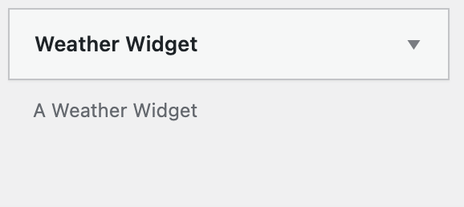

# JF Weather Plugin
### This is a sample Wordpress plugin written by Jeremy J Fall.
The plugin demonstrates:
*  Activation/Deactivation (creates and removes a DB table)
*  Use of the Wordpress Plugin API
*  Use of the WP Admin and custom settings
*  Shortcode usage
*  Widget usage

## Setup
Once the plugin has been activate, a "Weather" settings page becomes available in Wordpress:

You can get your own API key from OpenWeatherMap.org.  Additionally, you can get your 
Longitude and Latitude from any mapping site.

Now that the plugin is configured, you can use the plugin features.

## Widget
The weather widget can be display in any Widget container.

Drag the widget to a widget container to display on the frontend, and provide a title.

The widget appears on your frontend:

## Shortcode

The plugin also allows weather data to be displayed anywhere shortcodes are allowed:

Simply add the shortcode text `[weather field="fieldname"]` where field can be one of the following:
* sunrise
* sunset
* temp
* feels_like
* pressure
* humidity
* dew_point
* uvi (UV Index)
* clouds
* visibility
* wind_speed
* wind_deg

For example:

